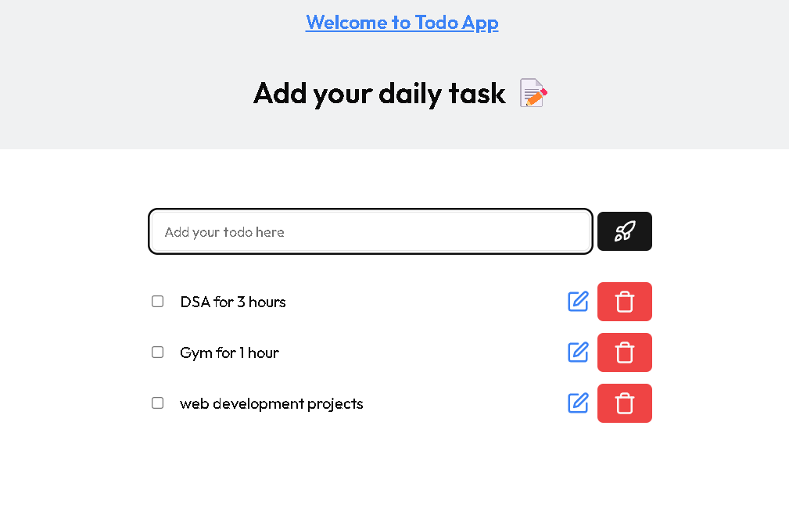

# Todo App




This is a simple to-do list website built using Next.js, Shadcn, Tailwind CSS, and Zustand. It allows users to create, read, update, and delete tasks, as well as mark tasks as complete using checkboxes.Additionally, it supports local storage for saving tasks.

## Features

- **Create Task**: Users can add new tasks to the list by typing in the input field and clicking the "Add Task" button.
- **Read Task**: The list displays all tasks with their respective checkboxes for completion status.
- **Update Task**: Users can edit existing tasks by clicking the "Edit" button, modifying the text, and then clicking "Save".
- **Delete Task**: Tasks can be removed from the list by clicking the "Delete" button.
- **Checkbox for Completion**: Each task has a checkbox that users can check to mark the task as complete.
- **Local Storage**: Tasks are saved to local storage, allowing users to persist their tasks even after closing the browser.

## Technologies Used

- **Next.js**: React framework for building server-side rendered and statically generated applications.
- **Shadcn**: A minimalistic and lightweight CSS framework for styling.
- **Tailwind CSS**: A utility-first CSS framework for rapidly building custom designs.
- **Zustand**: A state management library for React applications, providing a simple and straightforward API for managing global state.

## Getting Started

1. Clone the repository:

   ```bash
   git clone https://github.com/Sayakdutt/Todo-Zustand
   cd Todo-Zustand
   ```

2. Install dependencies:

   ```bash
   npm install
   ```

3. Run the development server:

   ```bash
   npm run dev
   ```

4. Open [http://localhost:3000](http://localhost:3000) in your browser to view the todoList website.

